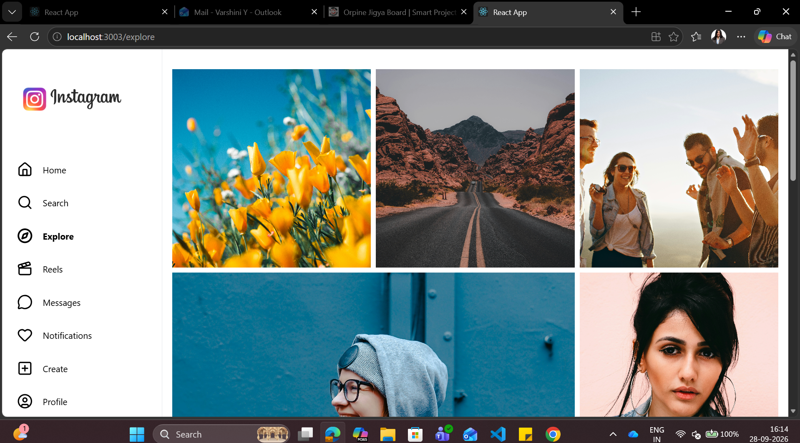
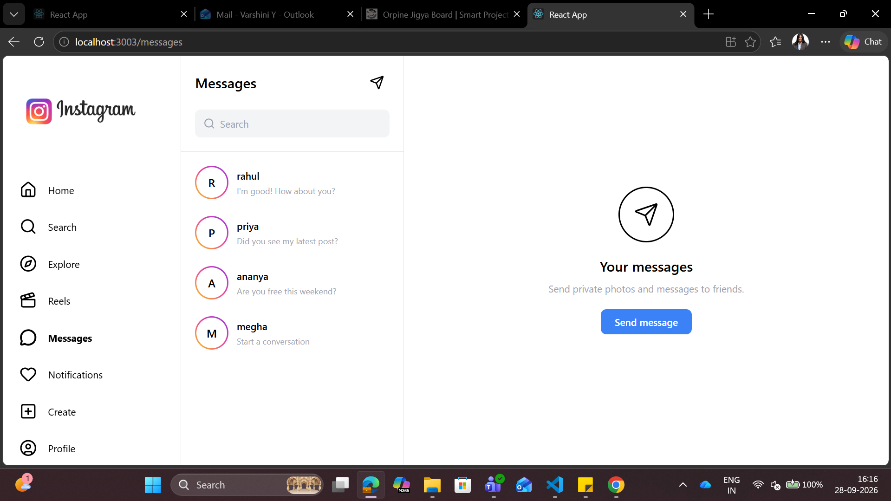
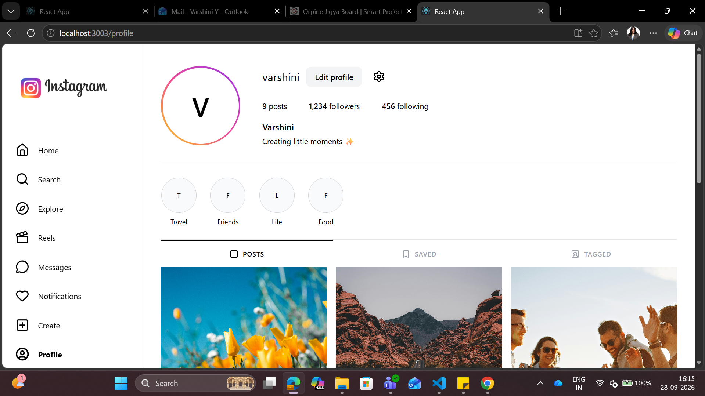

# Instagram Clone — React

A modern Instagram-inspired social media web application built with React and Tailwind CSS.

This project recreates the core Instagram experience with interactive stories, posts, reels, messaging, notifications, profile management, search, explore, and post creation.

> Built as a React learning project to practice component-based development, state management, routing, responsive UI, and interactive user experiences.

## 📸 Preview

### Home


### Explore



### Messages



### Profile



## ✨ Features

### 🏠 Home

* Instagram-style feed
* Interactive stories
* Story viewer with next/previous navigation
* Like posts
* Double-click to like
* Comments
* Save/bookmark posts
* Share posts
* Suggested accounts

### 🔍 Search

* Search users by username or name
* Real-time filtering
* Clear search functionality
* No-results state

### 🧭 Explore

* Responsive photo grid
* Featured larger post
* Image preview modal
* Hover interactions

### 🎬 Reels

* Full-screen vertical reel layout
* Like reels
* Save reels
* Sound toggle UI
* Reel interaction buttons

### 💬 Messages

* Search conversations
* Select users
* Conversation view
* Send messages
* Message bubbles
* Mobile conversation navigation
* Call, video and information actions

### ❤️ Notifications

* Like notifications
* Follow notifications
* Mention notifications
* Message notifications
* Follow/unfollow interaction
* Remove individual notifications
* Clear all notifications

### ➕ Create Post

* Upload an image
* Image preview
* Caption
* Character counter
* Add location
* Post preview
* Share confirmation

### 👤 Profile

* Profile header
* Posts, followers and following stats
* Story highlights
* Posts grid
* Saved posts
* Tagged section
* Edit profile
* Update username, name and bio

## 🛠️ Tech Stack

| Technology       | Usage                         |
| ---------------- | ----------------------------- |
| React            | Frontend UI                   |
| React Router     | Page navigation               |
| Tailwind CSS     | Styling and responsive design |
| Lucide React     | Interface icons               |
| JavaScript       | Application logic             |
| Create React App | Development environment       |

## 📂 Project Structure

```text
src/
│
├── assets/
│   └── instagram-logo.png
│
├── components/
│   ├── Navbar.jsx
│   ├── PostCard.jsx
│   └── Suggestions.jsx
│
├── pages/
│   ├── Home.jsx
│   ├── Search.jsx
│   ├── Explore.jsx
│   ├── Reels.jsx
│   ├── Messages.jsx
│   ├── Notifications.jsx
│   ├── CreatePost.jsx
│   └── Profile.jsx
│
├── hooks/
│
├── data/
│
├── App.jsx
├── index.css
└── index.js
```

## 🚀 Getting Started

### 1. Clone the repository

```bash
git clone https://github.com/YOUR-USERNAME/YOUR-REPOSITORY.git
```

### 2. Navigate into the project

```bash
cd YOUR-REPOSITORY
```

### 3. Install dependencies

```bash
npm install
```

### 4. Start the development server

```bash
npm start
```

The application will open at:

```text
http://localhost:3000
```

## 🎯 What I Practiced

This project helped me practice:

* React functional components
* useState
* Event handling
* Conditional rendering
* Array methods such as map() and filter()
* Component props
* React Router
* Responsive design
* Tailwind CSS
* Interactive UI states
* Form handling
* Modal interfaces
* Mobile-first layouts
* Reusable components
* User interactions and state updates

## 📱 Responsive Design

The application is designed to work across:

* 💻 Desktop
* 💻 Laptop
* 📱 Mobile
* 📟 Tablet-sized screens

The navigation automatically adapts between a desktop sidebar and mobile bottom navigation.

## 🔮 Future Improvements

Some features that can be added as the project evolves:

* User authentication
* Backend integration
* Database integration
* Persistent posts
* Persistent messages
* Real-time messaging
* Image storage
* Follow/follower system
* Real notifications
* Search API
* Infinite scrolling
* Video uploads
* Dark mode

## 💡 Why I Built This

The goal of this project was to go beyond static React pages and build an application with real user interactions and reusable components.

Instead of focusing only on the visual layout, the project explores how different parts of a social media application work together — from creating posts and interacting with content to messaging and managing a profile.

## ⭐ Project Highlights

* Component-based React architecture
* Responsive Instagram-inspired UI
* Interactive social media features
* Reusable UI components
* Clean Tailwind CSS implementation
* Multiple routed pages
* Mobile and desktop layouts

## 📌 Disclaimer

This is an independent educational project inspired by Instagram's user experience.

It is not affiliated with, endorsed by, or sponsored by Instagram or Meta.

All application code was independently implemented for learning and portfolio purposes.

## 👩‍💻 Author

Varshini Yogarajan

Frontend / React Learning Project

If you found this project interesting, feel free to ⭐ the repository!
